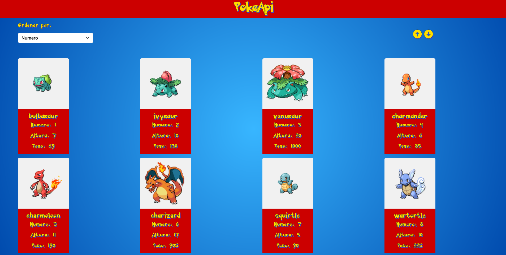

# PokeApi




Este projecto fue generado con [Angular CLI](https://github.com/angular/angular-cli) version 17.1.1.

A continuacion, sigue estos pasos para poder utilizar el proyecto localmente.


## Descarga Angular CLI

```
  npm install -g @angular/cli
```
## Clonar el repositorio

```
  git clone  https://github.com/Santiago-Aquino/pokeapi
```
    
## Inicar el proyecto

Parate en la carpeta del repositorio recientemente descargado y ejecuta:

```
  ng serve
```
    
## Demo

https:goggle.com.ar


## Herramientas

- 
- 
- 

```
Tambien utilize "boxicons" para el uso de iconos
```
